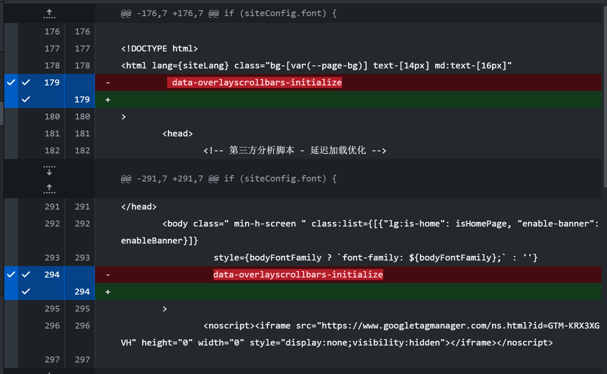

# 🔍步骤一：移除 OverlayScrollbars 的全局初始化

找到/src/Layout.astro  编辑

请将 179行和294行
data-overlayscrollbars-initialize 属性删除。



# 🔧 步骤二：恢复原生 CSS 滚动条

```

/* 恢复全局右侧滚动条 */
/* 添加到 <style is:global> 块中 */

/* 针对 Webkit 内核浏览器 (Chrome, Edge, Safari) */
::-webkit-scrollbar {
    width: 8px; /* 滚动条宽度 */
    height: 8px; /* 横向滚动条高度 */
}

::-webkit-scrollbar-track {
    background: transparent; /* 轨道背景透明 */
}

::-webkit-scrollbar-thumb {
    /* 使用一个与主题协调的半透明颜色 */
    background-color: rgba(156, 163, 175, 0.4); 
    border-radius: 4px; /* 圆角 */
}

::-webkit-scrollbar-thumb:hover {
    background-color: rgba(107, 114, 128, 0.6); /* 悬停时加深 */
}

/* 针对 Firefox */
html {
    /* 允许浏览器使用原生滚动条，并设置样式 */
    scrollbar-width: thin; 
    scrollbar-color: rgba(156, 163, 175, 0.4) transparent; 
}

```


# ✅ 总结与验证
删除 <html> 和 <body> 上的 data-overlayscrollbars-initialize 属性。

添加上述美化后的 ::-webkit-scrollbar 和 scrollbar-width CSS 代码到 Layout.astro 底部的 <style is:global> 块中。

运行 npm run dev 或重新部署您的博客进行验证。

如果右侧的滚动条成功出现，那么问题就解决了。