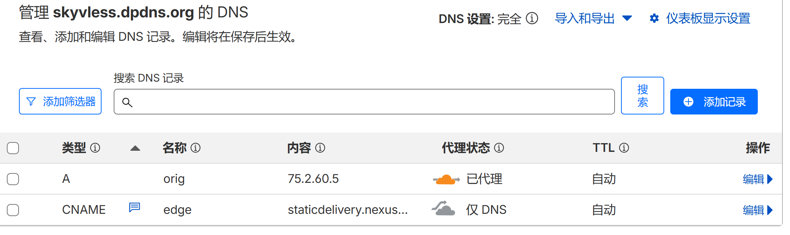
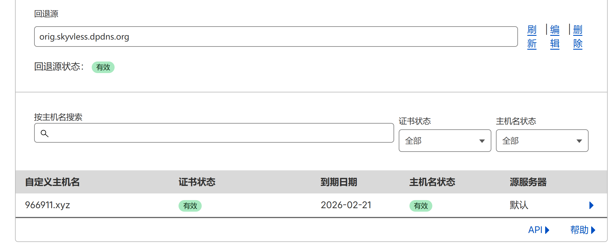
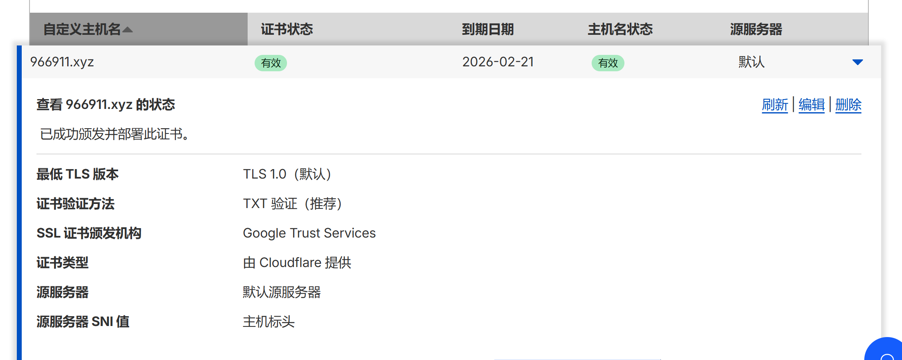
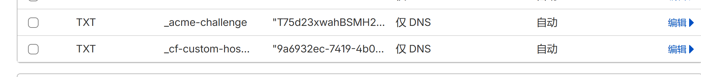
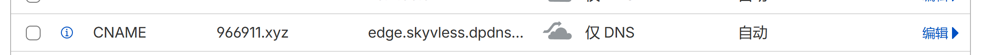

# 🚀 教程：Cloudflare SaaS + 优选 IP 终极提速指南（支持任意 Web 主机）

## 💡 导语：为什么需要 SaaS 加速？

根据实测，Cloudflare 可能会给您的站点分配有限的几个边缘服务器（边缘节点）。由于物理距离的关系，全球用户请求的路径依然较长，速度提升不明显。

### SaaS 加速（Custom Hostnames）的优势在于：

1. 极高的节点密度： 能够调动 Cloudflare 遍布全球的数十个甚至上百个边缘节点，大大缩短用户与节点的物理距离。
2. 回退源加密直连： Cloudflare 边缘网络通过一个加密的“回退源”（Fallback Origin）直接拉通源站，数据传输效率更高。
3. 结合优选 IP： 通过 CNAME 记录，让用户能连接到速度最快的 Cloudflare IP（优选 IP），实现速度最大化。

## 🛠️ 前期准备（必备条件）

要实现本方案，您需要准备两个不同的域名。

1. 回退域名 (orig.skyvless.dpdns.org)：

* 用途： 必须全程托管在 Cloudflare 上。用于开启 SaaS 服务，并作为 Cloudflare 边缘网络回退到您源站的桥梁。
* 示例： orig.skyvless.dpdns.org

2. 主力域名 (966911.xyz)：

* 用途： 用户最终访问的域名。
* 示例： 966911.xyz

3. 源站 IP： 您服务器的真实 IP 地址。
4. 公共优选 加速 CNAME：cf.090227.xyz大全（推荐用：staticdelivery.nexusmods.com）。

## ⚙️ 核心配置步骤（共 5 步）

### 步骤一：配置回退域名（orig.skyvless.dpdns.orgFallback ）的 DNS

首先，登录您的 Cloudflare 账户，进入作为 回退域名 的站点（例如 milaone.ip）进行 DNS 配置。

* 1.1 添加源站 A 记录
  用于指向您的真实源站，并开启 CDN。
* 类型： A
* 名称： orig (源站，可自定义)
* IPv4 地址： 您的真实源站 IP
* 代理状态： 已代理（橙色云朵 ON）

1.2 添加优选 CNAME 记录
用于作为主力域名的 CNAME 目标。

* 类型： CNAME
* 名称： edge (加速，自定义即可)
* 目标： 填入公共优选 CNAME 地址（例如：1.cf.090227.xyz）
* 代理状态： 关闭（橙色云朵 OFF）

**显示回退域名DNS记录列表，包含or的A记录和age的CNAME记录**

**orig开启加速 指向源站，源站绑定域名**

**edge关闭加速 指向优选加速域名 staticdelivery.nexusmods.com**

### 步骤二：开启 Cloudflare 自定义主机名（SaaS）

SaaS 服务在 Cloudflare 中叫作 自定义主机名（Custom Hostnames）。

1. 在 Cloudflare 仪表盘中，进入回退域名的设置页面。
2. 点击左侧菜单栏的 SSL/TLS，然后选择 自定义主机元（Custom Hostnames）。

注意： 首次使用此功能，Cloudflare 可能要求您绑定支付方式，但服务本身是免费的。

* 2.1 设置回退源（orig.skyvless.dpdns.org）
  回退源： 填入您在步骤 1.1 中创建的 A 记录域名（例如：or.milaone.ip）。
* 点击 添加回退源。等待状态变为“有效”。

显示设置回退源的界面，填入orig.skyvless.dpdns.org

### 步骤三：添加并验证主力域名（966911.xyz）

接下来，我们将您的主力域名作为自定义主机名添加进来。

1. 点击 添加自定义主机名。
2. 自定义主机名： 填入您的主力域名（例如：966911.xyz）。
3. 点击 添加。

3.1 验证域名所有权

1. 添加完成后，Cloudflare 会要求您验证主力域名所有权，并提供两条 TXT 记录。
2. 展开您刚添加的主力域名条目。
3. 复制 Cloudflare 提供的 两条 TXT 记录 的“名称”和“内容/值”。
4. 重要： 登录主力域名的 DNS 管理平台（如果它不是在 Cloudflare 托管，就在其他地方，例如阿里云或 GoDaddy）。

将这两条 TXT 记录添加到主力域名的 DNS 中。

显示在CustomHostnames界面复制两条TXT记录的画面

显示在主力域名DNS平台添加两条TXT记录的画面

### 步骤四：配置主力域名（966911.xxyz）的 CNAME

这是实现优选 IP 接入的关键一步。在完成步骤三的 TXT 记录验证后，回到主力域名的 DNS 管理平台。

1. 找到您主力域名的 A 记录（例如 www 的 A 记录）。
2. 编辑该记录：

* 类型： 改为 CNAME
* 名称： 保持不变
* 目标： 指向您在步骤 1.2 中创建的 CNAME 记录（例如：edgeo.skyvless.dpdns.org）

这样，访问 966911.xyz 的用户：

* 先通过 CNAME 记录指向 edgeo.skyvless.dpdns.org（这是 Cloudflare 的优选 CNAME）。
* 通过优选 IP 接入到最近的 Cloudflare 边缘节点。
* 该边缘节点识别到 966911.xyz 主机名，并通过回退源 org.skyvless.dpdns.org 获取您源站的内容。

显示主力域名DNS中，记录被修改为CNAME，目标指向edgeo.skyvless.dpdns.org的画面

### 步骤五：最终验证

1. 回到回退域名的 Custom Hostnames 页面。等待主力域名的状态变为 “有效”。
2. 使用 itdog 或类似工具进行快速测试。
3. 在解析统计中，如果能看到解析出了多个 IP 地址，说明您的 SaaS 加速已成功启用！
4. 此时，您的网站速度将获得显著提升，实现了优选 IP 带来的全球加速效果。

希望这篇图文教程能帮助您的读者成功部署！
## 视频教程

    <iframe
        src="https://www.youtube.com/embed/o7N4lm_qNHc"
        title="YouTube video player"
        frameborder="0"
        allow="accelerometer; autoplay; clipboard-write; encrypted-media; gyroscope; picture-in-picture; web-share"
        referrerpolicy="strict-origin-when-cross-origin"
        allowfullscreen
        style="position: absolute; top: 0; left: 0; width: 100%; height: 100%; border-radius: 8px;"
    ></iframe>

### 都看到这里了，你可能还想看：  
<a href="/posts/10/" target="_blank" rel="noopener noreferrer">
    我的博客折腾记录
</a>