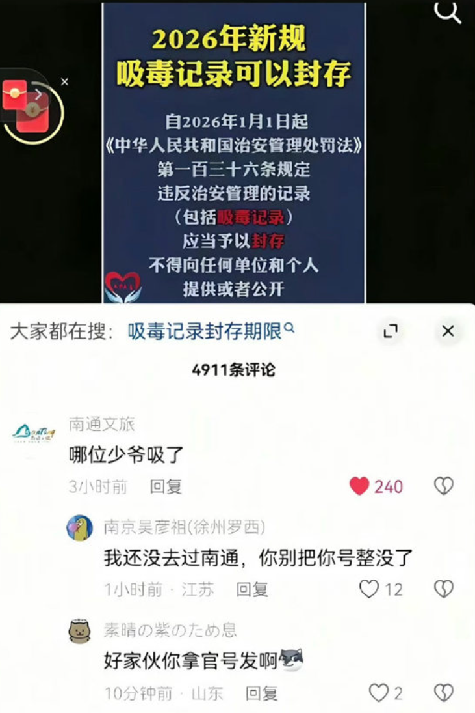
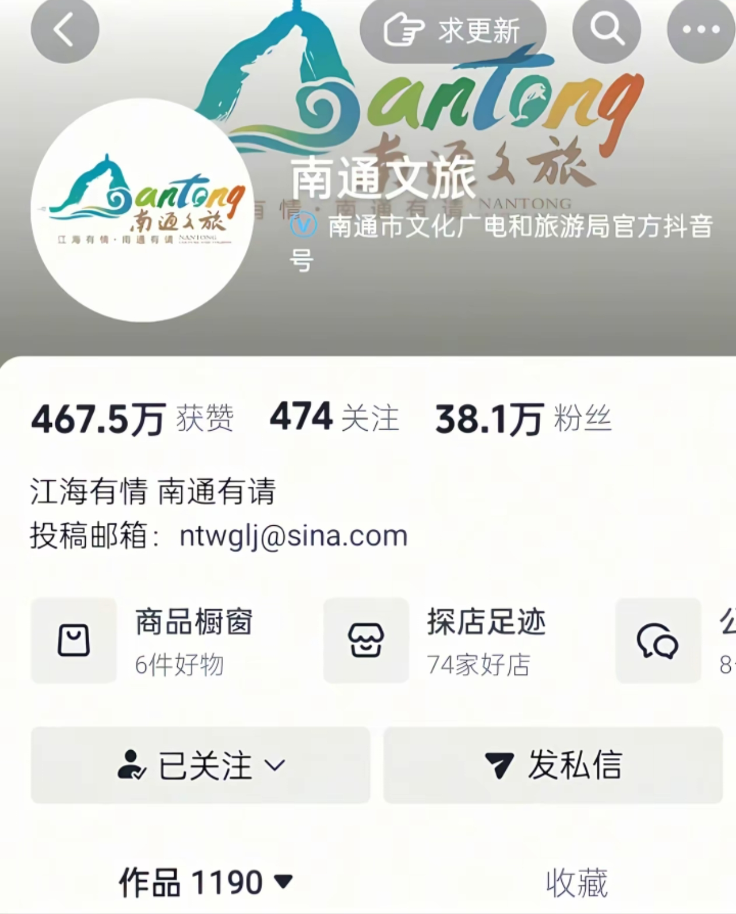
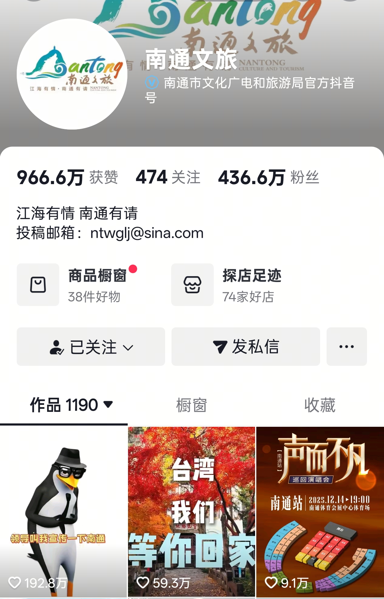

# “哪位少爷吸了”：南通文旅一句评论引爆全网

## 🚨 事件起因

**2025年11月27日**，中国江苏省南通市文化和旅游局官方抖音账号**【南通文旅】**在新疆生产建设兵团女子强制隔离戒毒所官方账号**【兵团禁毒】**发布的一条视频下，留下了一句评论：

> **"哪位少爷吸了"**

这条评论迅速引爆网络，成为现象级网络热梗！

## 📊 惊人数据：7天涨粉400万+

| 时间节点           | 粉丝数量          | 增长幅度           |
| ------------------ | ----------------- | ------------------ |
| 11月27日前         | **38.1万**  | -                  |
| **11月30日** | **436.6万** | **+398.5万** |
| **增长率**   | **1045%**   | **7天奇迹**  |

> **有趣的现象**：南通文旅粉丝量出现"**涨停板**"现象😂

## 🔥 政策背景与争议焦点

### 新规内容

- **2026年吸毒记录封存政策**
- 涉及部分涉毒等违法犯罪记录的封存

### 公众担忧

1. **特权庇护疑虑**：普通人犯错可能终身背负，"少爷"是否能轻松洗白？
2. **公平正义质疑**：法律面前人人平等的底线能否守住？
3. **禁毒成果担忧**：对得起牺牲的缉毒警察吗？

## 💬 南通文旅的"六字真言"

**"哪位少爷吸了"** 这六个字为何如此犀利？

| 字面含义   | 深层含义     | 社会情绪     |
| ---------- | ------------ | ------------ |
| 直指"少爷" | 质疑特权阶层 | 普通人的愤怒 |
| 简短有力   | 一针见血     | 网络共鸣     |
| 幽默调侃   | 严肃关切     | 情绪宣泄     |

## ⚠️ 网络审查动态

**最新情况**：

> ✅ **"哪位少爷吸了"** 已沦为**抖音违禁词**

## 🏛️ 历史记忆与社会共识

### 鸦片战争的屈辱

- **1840年**：鸦片战争爆发
- **百年屈辱**：毒品给中华民族带来的深重灾难

### 缉毒英雄的牺牲

> **2023年全国缉毒警察牺牲人数**：**127人**
> **平均每天**：**0.35人**

| 牺牲原因 | 占比 |
| -------- | ---- |
| 执法冲突 | 62%  |
| 卧底任务 | 28%  |
| 其他     | 10%  |

## 📜 经典名言

> **鲁迅先生**曾言：
>
> **"为众人抱薪者，不可使其冻毙于风雪；**
> **为自由开路者，不可使其困顿于荆棘。"**

## 🎯 事件意义

1. **民间声音的觉醒**：普通网民对政策敏感度的提升
2. **网络舆论的力量**：一句评论改变公众认知
3. **公平正义的呼唤**：法律面前真正的人人平等
4. **禁毒事业的坚守**：红线不容突破

## 🔍 后续观察

| 关注点   | 现状         | 预测             |
| -------- | ------------ | ---------------- |
| 政策解释 | 官方尚未回应 | 可能出台细则     |
| 南通文旅 | 粉丝持续增长 | 成为"民间代言人" |
| 网络热词 | 已成违禁词   | 可能衍生新表达   |
| 公众情绪 | 持续发酵     | 关注政策落实     |

## 💭 思考与讨论

**你怎么看这个事件？**

1. **支持封存政策**：给戒毒者改过自新的机会
2. **反对特权封存**：坚决杜绝"少爷"钻空子
3. **条件性支持**：严格限定封存条件
4. **其他看法**

---

> **南通文旅用六字真言，戳破了政策执行中的最大痛点：**
>
> **"公平"二字，永远是法治的试金石！**

**欢迎在评论区留言！**
