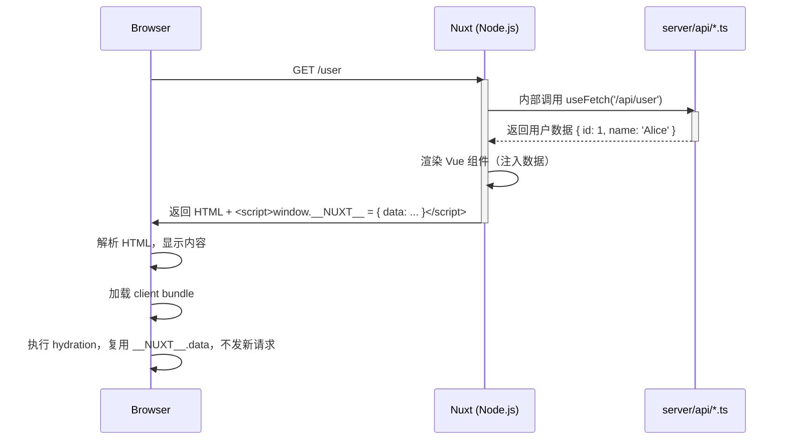

## 四、Nuxt 服务端渲染（SSR）完整流程

以下是 **一次页面访问的完整 SSR 流程**（以 `/user` 为例）：

### 关键步骤说明：

1. **路由匹配**：Nuxt 根据 URL 匹配页面组件（如 `pages/user.vue`）
2. **服务端数据获取**：执行 `<script setup>` 中的 `useFetch` / `useAsyncData`
3. **内部 API 调用**：`/api/user` 被 Nitro 路由到 `server/api/user.get.ts`
4. **HTML 生成**：将数据注入 Vue 组件，生成完整 HTML
5. **客户端激活**：浏览器加载 JS，从 `window.__NUXT__` 读取数据，避免重复请求

---
