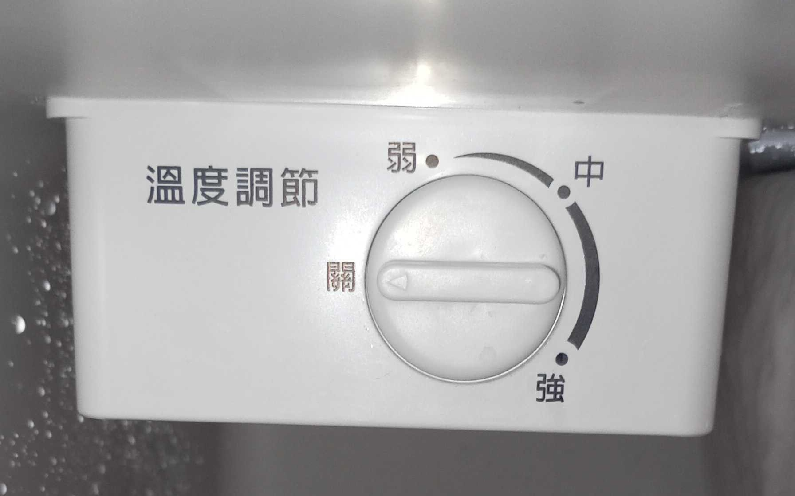
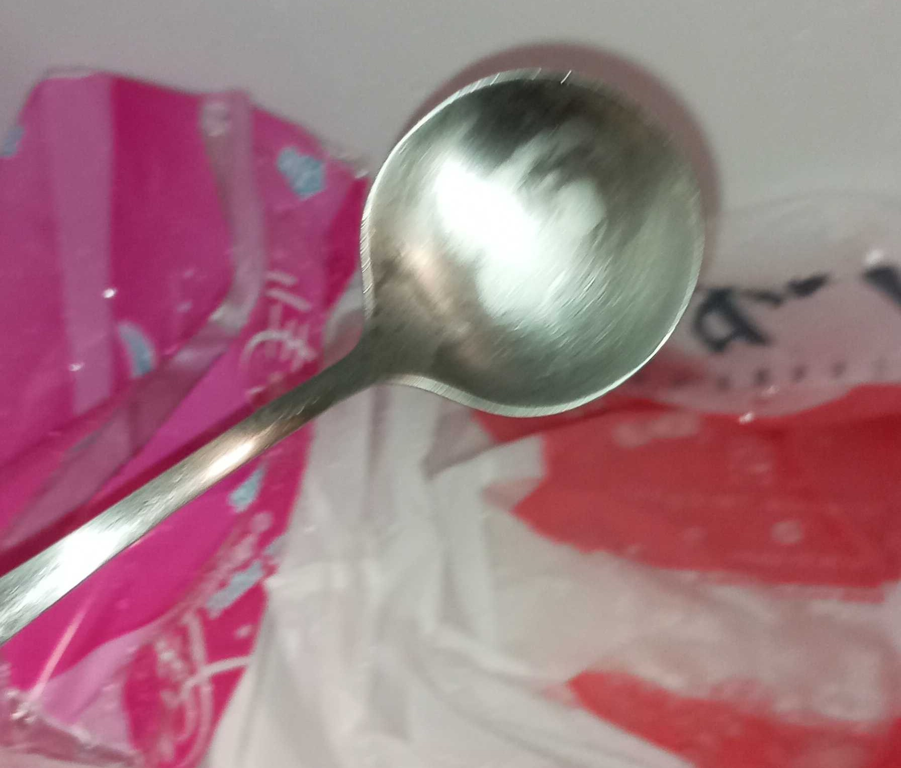
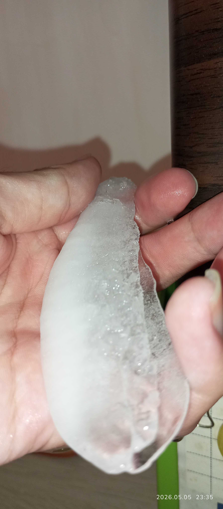
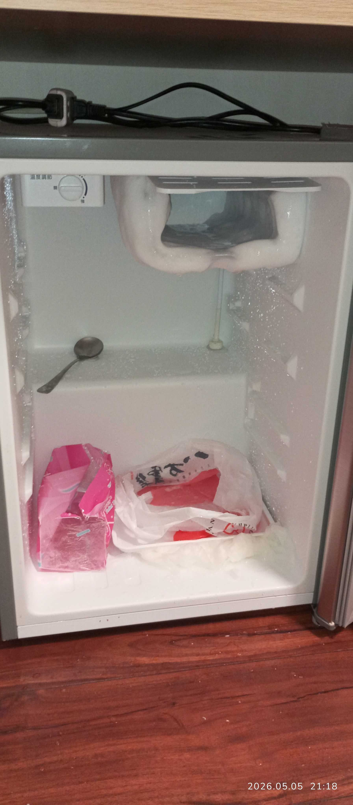
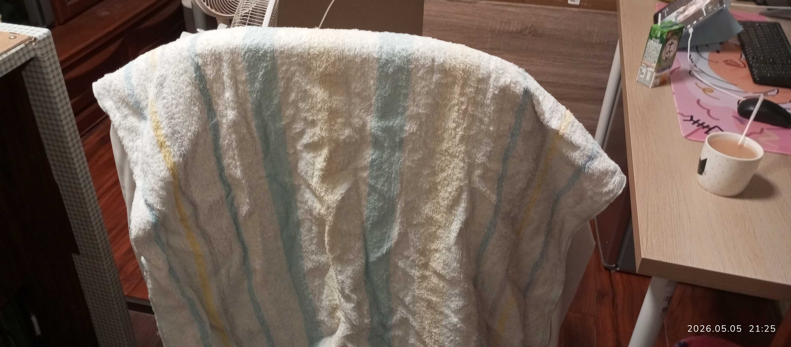
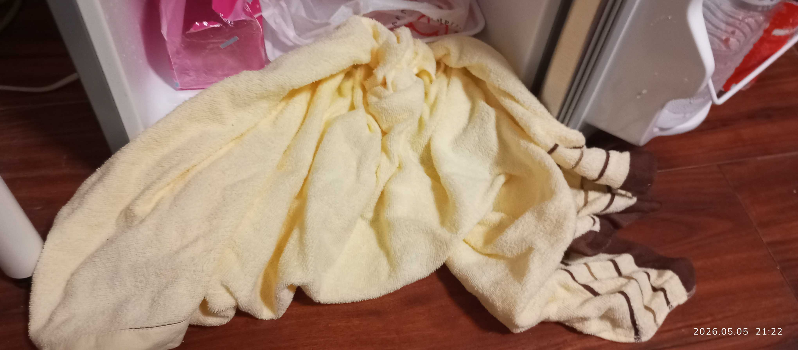
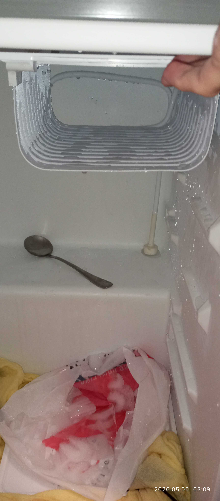

## 本文主要指南 當你遇到冷凍庫 解了很大冰要怎麼處理

解決方式也相對簡單

## 首先 清空你冰箱需要冰的東西

這一點如果你有主大冰箱 把他暫時搬過去即可

沒有你可以選擇先把他吃掉喝掉 清掉後再來考慮清理

## 把冰箱制冷關閉

把旋鈕轉到關就關閉制冷了

你可以用湯匙稍微刮掉一些冰塊

像以下視頻演示

::warning[小心刮 別刮壞了]

::video[Demo Clip]{ src="https://coffee3322.ccwu.cc/api/s/xf1q1s/VID_20260505_212018.mp4" controls=true autoplay=false width="100%" height="468px" muted=true}

::tip[關於這一點其實 你可以等他融化]

### 這點後面發現是不太必要的

因為他融化得差不多 你就能很輕易取得一大塊冰塊

## 然後這麼處理他融化後的水呢?

這一點 別像主播笨笨的 比較後面才拿毛巾擦

這裡比較搞笑的是前面 我是用衛生紙去擦融化的水

其餘沒溢出的用塑膠袋接 如圖

## 毛巾/抹布/浴巾

這一點 你要懂得變通

不要笨笨的沒想到 其他也可以用

這一點是指 抹布

如果你找不到乾淨的抹布 而像我剛開始選擇直接衛生紙處理

但其實有更好的選擇 其實可以拿毛巾/浴巾

甚至你可以拿一個衣服來吸融化的水

只要是能吸掉融化的水 以及擦乾就好

 

然後就是他後面融化的差不多的後續呢

# 尾聲

 

把溫度調解 轉回去合適的區間

例如: 中

這一點在你冰箱手冊上應該有說

然後放回你要冰的東西或者沒有

 

