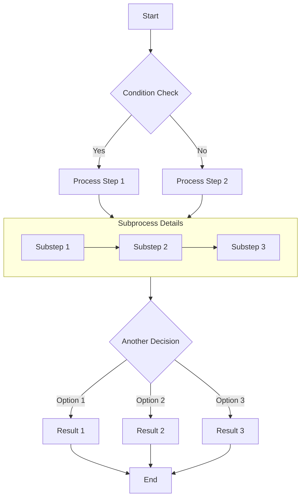
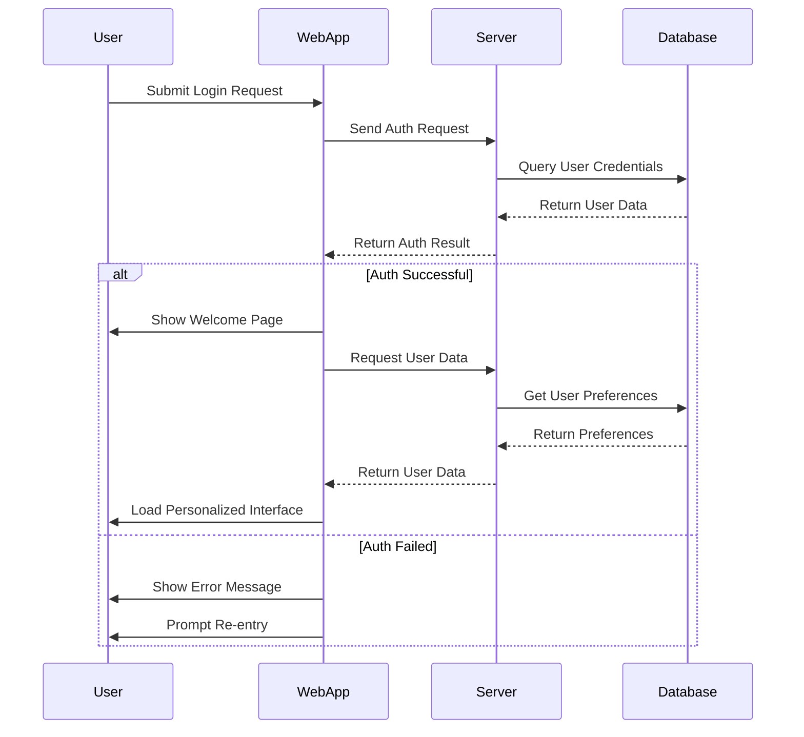
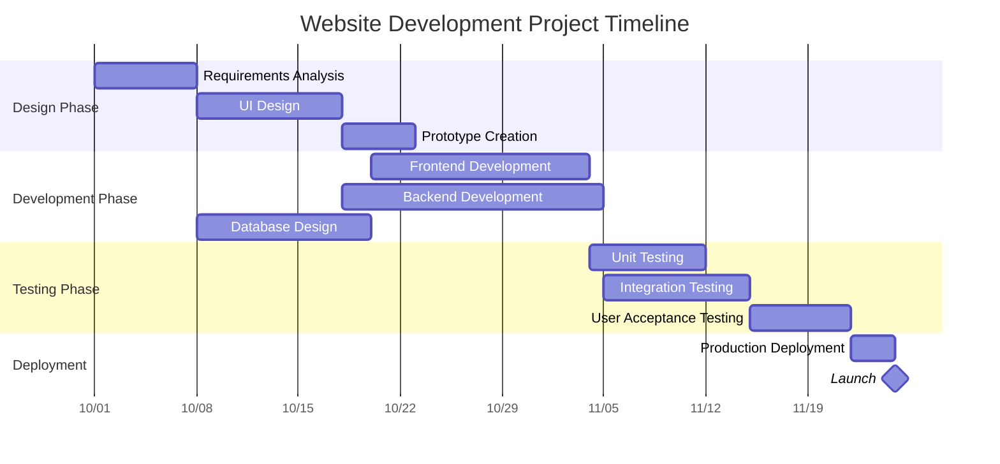
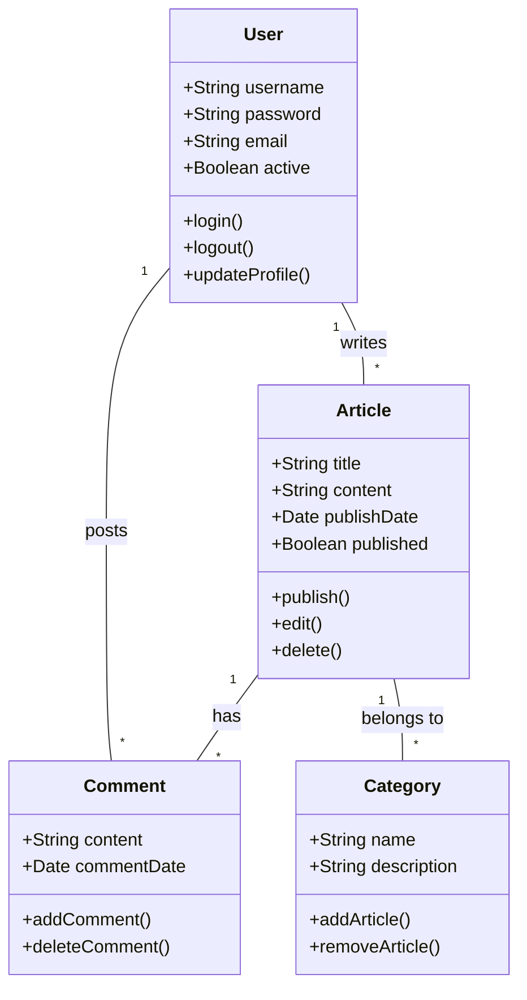
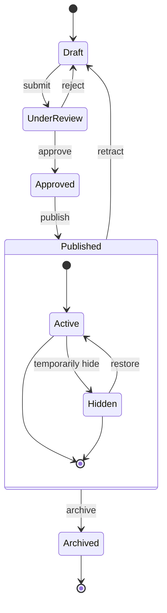
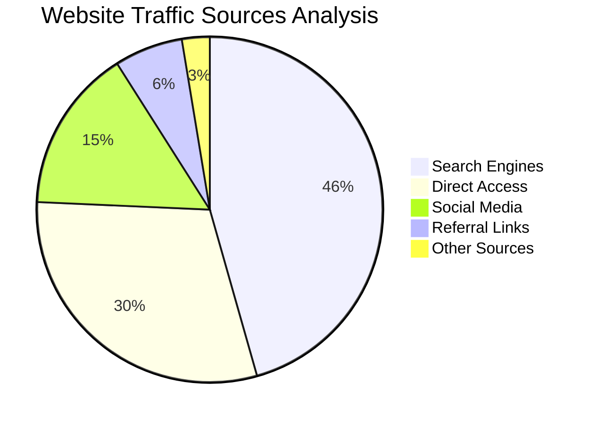

[TOC]

# 第一篇文章

晚上好。

# 文章格式

> 以下内容来自[Astro Docs](https://docs.astro.build/)以及[Mizuki主题](https://docs.mizuki.mysqil.com/)自带的文章.

## Markdown教程

见[Markdown Tutorial](/posts/markdown-tutorial)。

## 文章开头

```Markdown
---
title: 第一篇文章
published: 2026-06-14
pinned: false
description: 第一次使用Astro的Mizuki主题写的文章。
tags: ["Memo", "Mizuki", "Blogging", "Customization"]
category: 教程 
licenseName: "Unlicensed"
author: YKSetuna
sourceLink: https://blog.ykse27.fun/
draft: false
---
```

参考如下：

| Attribute         | Description                                                                                                                                                                                                 |
| -------------------| -------------------------------------------------------------------------------------------------------------------------------------------------------------------------------------------------------------|
| `title`           | The title of the post.                                                                                                                                                                                      |
| `published`       | The date the post was published.                                                                                                                                                                            |
| `pinned`          | Whether this post is pinned to the top of the post list.                                                                                                                                                    |
| `priority`        | The priority of the pinned post. Smaller value means higher priority (0, 1, 2...).                                                                                                                          |
| `description`     | A short description of the post. Displayed on index page.                                                                                                                                                   |
| `image`           | The cover image path of the post.<br/>1. Start with `http://` or `https://`: Use web image<br/>2. Start with `/`: For image in `public` dir<br/>3. With none of the prefixes: Relative to the markdown file |
| `tags`            | The tags of the post.                                                                                                                                                                                       |
| `category`        | The category of the post.                                                                                                                                                                                   |
| `alias`           | alias for the post. The post will be accessible at `/posts/{alias}/`. Example: `my-special-article` (will be available at `/posts/my-special-article/`)                                                     |
| `licenseName`     | The license name for the post content.                                                                                                                                                                      |
| `author`          | The author of the post.                                                                                                                                                                                     |
| `sourceLink`      | The source link or reference for the post content.                                                                                                                                                          |
| `draft`           | If this post is still a draft, which won't be displayed.                                                                                                                                                    |
| `encrypted`       | Whether this post is password protected.                                                                                                                                                                    |
| `password`        | The password to unlock the encrypted post.                                                                                                                                                                  |
| `passwordHint`    | A hint to help users remember the password. Displayed below the password input.                                                                                                                             |
| `hideHomeContent` | Whether to hide public post summaries, including the home page, meta tags, feed/API summaries, and share previews. Defaults to `true` when `password` is set.                                               |

## 文章位置

Your post files should be placed in `src/content/posts/` directory. You can also create sub-directories to better organize your posts and assets.

```
src/content/posts/
├── post-1.md
└── post-2/
    ├── cover.webp
    └── index.md
```

## 草稿

When the article is ready for publication, you can update the "draft" field to "false" in the Frontmatter:

```markdown
---
title: Draft Example
published: 2024-01-11T04:40:26.381Z
tags: [Markdown, Blogging, Demo]
category: Examples
draft: false
---
```

## Markdown流程图

### Flowchart Example

Flowcharts are excellent for representing processes or algorithm steps.



### Sequence Diagram Example

Sequence diagrams show interactions between objects over time.



### Gantt Chart Example

Gantt charts are perfect for displaying project schedules and timelines.



### Class Diagram Example

Class diagrams show the static structure of a system, including classes, attributes, methods, and their relationships.



### State Diagram Example

State diagrams show the sequence of states an object goes through during its life cycle.



### Pie Chart Example

Pie charts are ideal for displaying proportions and percentage data.



### Conclusion

Mermaid is a powerful tool for creating various types of diagrams in Markdown documents. This article demonstrated how to use flowcharts, sequence diagrams, Gantt charts, class diagrams, state diagrams, and pie charts. These diagrams can help you express complex concepts, processes, and data structures more clearly.

To use Mermaid, simply specify the mermaid language in a code block and describe the diagram using concise text syntax. Mermaid will automatically convert these descriptions into beautiful visual diagrams.

Try using Mermaid diagrams in your next technical blog post or project documentation - they will make your content more professional and easier to understand!

## 如何插入视频

Just copy the embed code from YouTube or other platforms, and paste it in the markdown file.

```yaml
---
title: Include Video in the Post
published: 2023-10-19
// ...
---

<iframe width="100%" height="468" src="https://www.youtube.com/embed/5gIf0_xpFPI?si=N1WTorLKL0uwLsU_" title="YouTube video player" frameborder="0" allowfullscreen></iframe>
```
### YouTube

<iframe width="100%" height="468" src="https://www.youtube.com/embed/5gIf0_xpFPI?si=N1WTorLKL0uwLsU_" title="YouTube video player" frameborder="0" allow="accelerometer; autoplay; clipboard-write; encrypted-media; gyroscope; picture-in-picture; web-share" allowfullscreen></iframe>

### Bilibili

<iframe width="100%" height="468" src="//player.bilibili.com/player.html?bvid=BV1fK4y1s7Qf&p=1&autoplay=0" scrolling="no" border="0" frameborder="no" framespacing="0" allowfullscreen="true" &autoplay=0> </iframe>

## Markdown扩展内容

### GitHub Repository Cards
You can add dynamic cards that link to GitHub repositories, on page load, the repository information is pulled from the GitHub API. 

::github{repo="LyraVoid/Mizuki"}

Create a GitHub repository card with the code `::github{repo="LyraVoid/Mizuki"}`.

```markdown
::github{repo="LyraVoid/Mizuki"}
```

### Admonitions

Following types of admonitions are supported: `note` `tip` `important` `warning` `caution`

:::note
Highlights information that users should take into account, even when skimming.
:::

:::tip
Optional information to help a user be more successful.
:::

:::important
Crucial information necessary for users to succeed.
:::

:::warning
Critical content demanding immediate user attention due to potential risks.
:::

:::caution
Negative potential consequences of an action.
:::

#### Basic Syntax

```markdown
:::note
Highlights information that users should take into account, even when skimming.
:::

:::tip
Optional information to help a user be more successful.
:::
```

#### Custom Titles

The title of the admonition can be customized.

:::note[MY CUSTOM TITLE]
This is a note with a custom title.
:::

```markdown
:::note[MY CUSTOM TITLE]
This is a note with a custom title.
:::
```

#### GitHub Syntax

> [!TIP]
> [The GitHub syntax](https://github.com/orgs/community/discussions/16925) is also supported.

```
> [!NOTE]
> The GitHub syntax is also supported.

> [!TIP]
> The GitHub syntax is also supported.
```

### Spoiler

You can add spoilers to your text. The text also supports **Markdown** syntax.

The content :spoiler[is hidden **ayyy**]!

```markdown
The content :spoiler[is hidden **ayyy**]!
```

## 固定连接

这是在Mizuki7.2以上加入的新特性,支持你为文章配置固定链接,优化SEO!

在文章的 Front Matter 中添加以下配置：

```Markdown
---
permalink: "encrypted-example"
---
```

他会相对于`posts`构建路径生成一个固定链接, 例如: `https://mizuki.site/posts/encrypted-example`

## 图片语法

这是在Mizuki8.0以上加入的新特性，支持你为图片设置缩放比例、标题和居中对齐！

使用以下语法可以设置图片的缩放比例、标题和居中对齐：

```Markdown

```

其中：
- `w-50%` 表示图片宽度为 50%（可以是任意百分比）
- `"图片标题"` 表示图片的标题（可选）